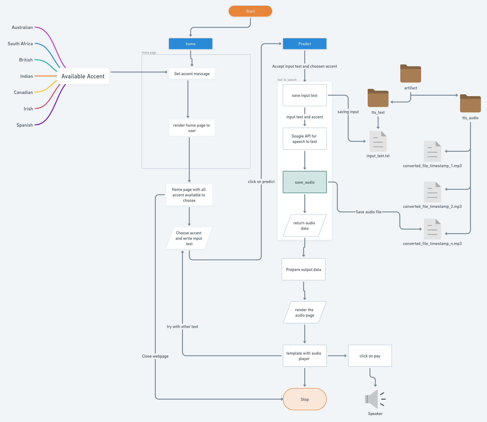

# text-to-speech-project
## Problem Statement: 
Develop an end-to-end app for text-to-speech.

## Implemented Solution:
1. Google's Text-to-Speech API for the conversion: gTTS
2. Develop a web app: Flask
3. Dockerize it and push it to the cloud: Gooogle Artifact Registry (GAR)
4. Deploy it on GCP
5. Use Github actions for CI/CD

## Flowchart:


## To run the app:
```bash
pip install -r requirements.txt
```
then,
```bash
python app.py
```